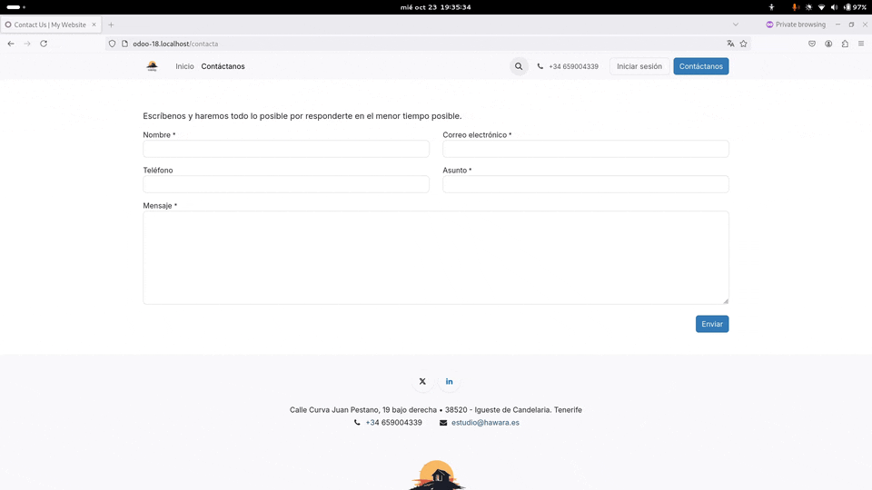
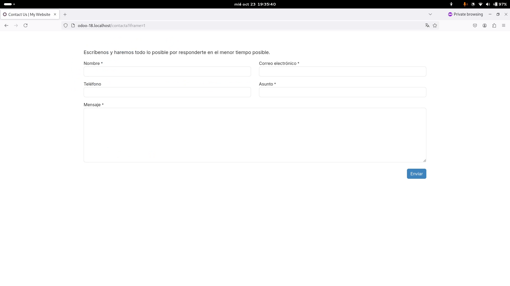

# Easy iFrame

The **Easy iFrame** addon makes your website respond to the **?iframe=1** request parameter by removing the page header and footer, making your webforms embedable via iframes in external sites.

## Usage

Just install the addon, which depends on **website** and then add the **?iframe=1** request to the webform or page that you want to embed when adding its URL to an **iframe** tag on an external site.

